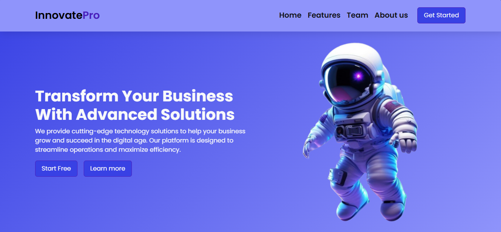

## 🌍 InnovatePro Business Solutions Website
A fully **responsive Business Solutions website** built with **HTML5, CSS3, Bootstrap 5 and JavaScript**.
This project showcases a modern, clean UI with animations and responsive design for desktop, tablet, and mobile devices.

## ✨ Features
-- 📱 **Responsive Design** (Desktop, Tablet, Mobile)
-- 🎨 **Modern UI/UX with** custom gradient color palette
-- 🚀 **Scroll Animations** using AOS Library
-- 🍔 **Responsive Navbar** with Hamburger menu
-- ✨ **Floating Animation** on hero image
-- 🎯 **Clean Business-Oriented Design**

## 🖼️ Demo
🔗 [Live Demo]()  

## 🚀 Technologies Used
-- **HTML5** – Semantic structure
-- **CSS3** – Flexbox, Variables, Animations, Media Queries
-- **JavaScript (ES6)** – DOM manipulation, hamburger menu
-- **Bootstrap 5** – Responsive framework
-- **AOS Library** – Animation on scroll
-- **Google Fonts** – Poppins font family

## 📸 Screenshots

### Desktop View
